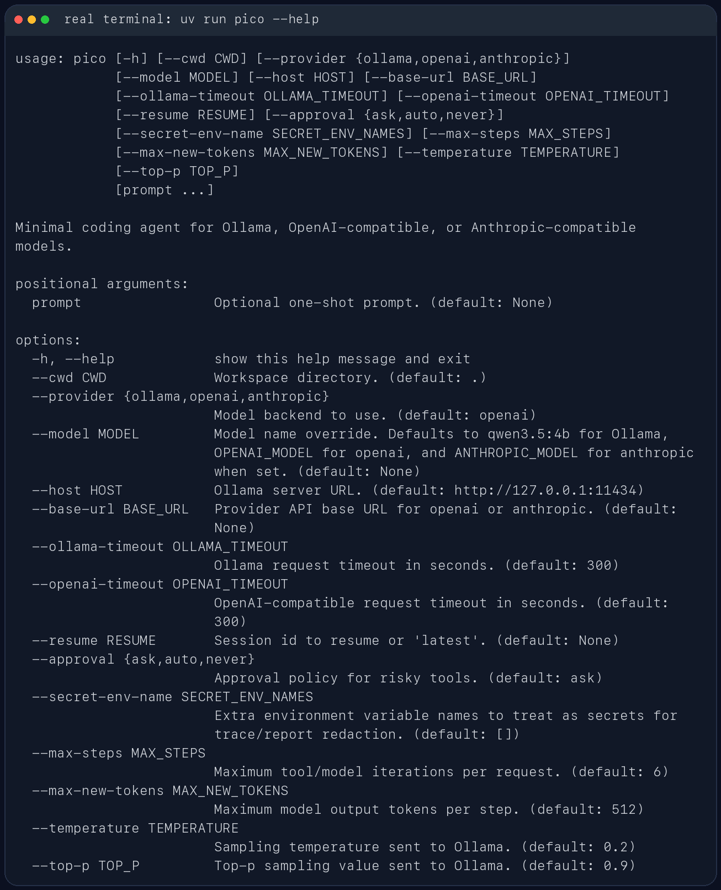
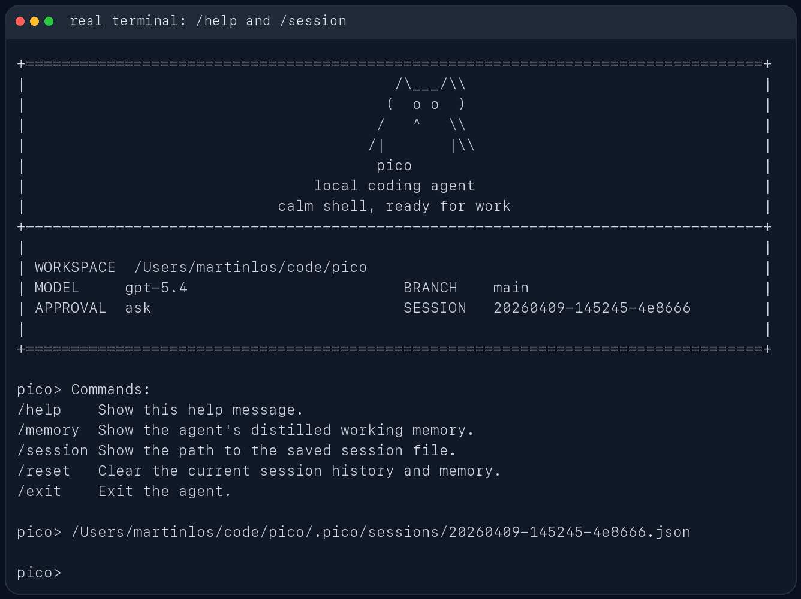

# CodeMind

CodeMind 是一个面向本地代码仓库的轻量级 Coding Agent Harness。它可以在终端中读取仓库、调用受约束工具、修改文件、运行验证命令，并把任务运行过程保存为可复盘的 trace / report / task_state。

这个项目的核心目标不是做一个普通聊天窗口，而是构建一个可以持续执行、恢复、评测和复盘的本地代码智能体，并进一步扩展到 Agent 后训练数据闭环。

## 适合做什么

- 在本地仓库中排查测试失败和轻量代码缺陷
- 读取当前代码结构并给出修改建议
- 基于现有文件执行小步迭代，而不是脱离仓库空想
- 保留多轮任务上下文，支持继续上一轮工作
- 采集真实 tool-use trajectory，用于 SFT / DPO 数据构造和 badcase 分析

## 主要能力

- 本地 Coding Agent 执行链路：CLI、模型适配、工具调用、会话状态和运行工件落盘
- 上下文管理：任务前缀、工作记忆、相关记忆、历史记录和当前请求分区裁剪
- Checkpoint / Resume：支持会话中断、上下文超预算和 workspace 漂移校验
- 工具安全治理：路径校验、参数校验、高风险操作审批、重复调用拦截和敏感信息脱敏
- Benchmark Eval：记录 pass rate、verifier pass、final-answer rate、tool steps 和 failure category
- 后训练数据闭环：支持 trajectory 解析、rule-based reward、SFT candidates、DPO preference pairs、held-out eval 和 targeted data augmentation

## 使用截图

CLI 帮助信息：



启动界面：


REPL 内置命令与会话路径：



## 安装

需要 Python 3.10+。

如果使用 `uv`：

```bash
uv sync
```

也可以安装为可编辑模式：

```bash
pip install -e .
```

## 快速开始

在当前仓库中启动交互模式：

```bash
uv run codemind
```

指定另一个工作目录：

```bash
uv run codemind --cwd /path/to/repo
```

直接运行一次性任务：

```bash
uv run codemind "inspect the test failures and propose a fix"
```

如果当前环境已经安装过包：

```bash
codemind
```

## 模型后端

### Ollama

```bash
ollama serve
ollama pull qwen3.5:4b
uv run codemind --provider ollama --model qwen3.5:4b
```

### OpenAI 兼容接口

```bash
export OPENAI_API_BASE="https://your-api.example/v1"
export OPENAI_API_KEY="your-api-key"
export OPENAI_MODEL="gpt-5.4"
uv run codemind --provider openai
```

### Anthropic 兼容接口

```bash
export ANTHROPIC_API_BASE="https://www.right.codes/claude/v1"
export ANTHROPIC_API_KEY="your-api-key"
export ANTHROPIC_MODEL="claude-sonnet-4-6"
uv run codemind --provider anthropic
```

## 后训练数据闭环

CodeMind 支持从真实 Agent 运行轨迹中构造后训练数据：

- `post_training/trace_loader.py`：加载 trace / report / task_state
- `post_training/reward.py`：基于 verifier、final answer、tool error、安全事件和工具步数做 rule-based reward
- `post_training/sft_builder.py`：导出 SFT 样本
- `post_training/dpo_builder.py`：构造 same-prompt DPO chosen / rejected pairs
- `scripts/prepare_post_training_datasets.py`：生成训练数据与 eval manifest
- `scripts/train_sft_lora.py`：SFT LoRA smoke training 入口
- `scripts/compare_base_vs_sft_eval.py`：base-vs-SFT held-out eval 对比入口

## 常用命令

生成 v3 后训练数据集：

```bash
python scripts/prepare_post_training_datasets.py --config configs/post_training_split_v3.json --out-dir artifacts/datasets/v3
```

验证 SFT 数据格式：

```bash
python scripts/sft_dry_run.py --data artifacts/datasets/v3/train_sft.jsonl --out artifacts/datasets/v3/sft_dry_run_report.json
```

验证 LoRA SFT 训练入口：

```bash
python scripts/train_sft_lora.py --config configs/sft_lora_smoke.json --dry-run
```

运行 held-out baseline：

```bash
python scripts/run_heldout_deepseek_baseline.py
```

生成 base-vs-SFT 对比报告：

```bash
python scripts/compare_base_vs_sft_eval.py --config configs/base_vs_sft_eval.json
```

## 安全与持久化

CodeMind 不会默认放开所有动作。Shell 执行、文件写入、Patch 修改等高风险操作会受审批模式控制：

- `--approval ask`
- `--approval auto`
- `--approval never`

每次运行结束后都会写出：

- `task_state.json`
- `trace.jsonl`
- `report.json`

这些运行工件默认只保存在本地，不需要随仓库提交。

## 开发

如果安装了 Ruff，可以这样检查：

```bash
uv run ruff check .
```
